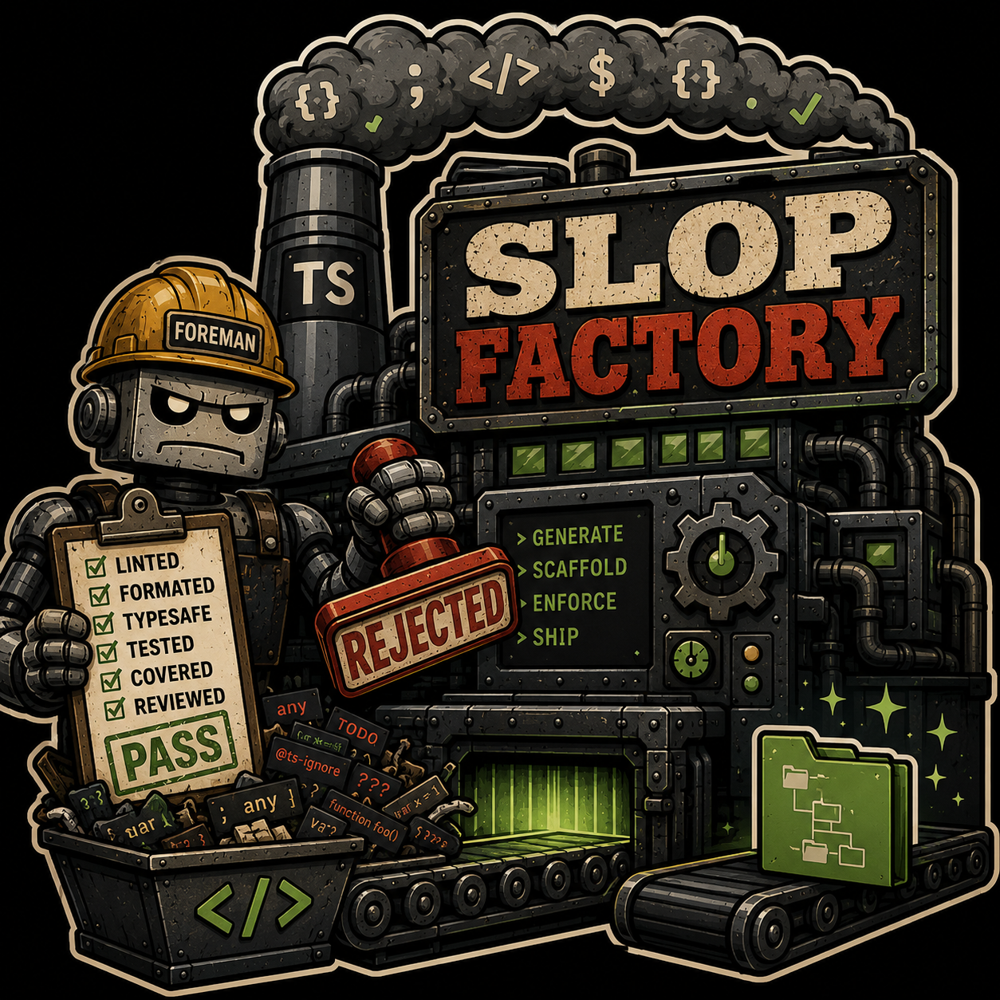

# slop-factory



Generate a TypeScript project that already has the parts you would otherwise bolt on in month three: one
gate command, a coverage floor that fails the build, a pre-commit hook, CI, a secret scanner, and rules an
agent can read. No application code — the first thing you write is the feature.

```bash
npx slop-factory generate
```

No clone, no install.

## What a generated project gets

Every row is a file you can read in [`examples/`](examples/) before deciding.

| | |
|---|---|
| **One gate command** | `check:all` runs Biome → `tsc --noEmit` → tests, cheap-first, so a type error surfaces in seconds instead of after the suite. `scripts/gate.ts` detects npm, pnpm, bun or yarn at runtime, so the command is the same whichever you use. |
| **A coverage floor that fails** | 85%, enforced in CI. Under Vitest that is four metrics — lines, branches, functions **and** statements — over an explicit `src/**/*.ts` include, so an untested file counts against you rather than vanishing from the table. Under `bun test` it is functions and lines only, with no include; [#5](https://github.com/vx-daniel/slop-factory/issues/5) carries the measurement. `COVERAGE.md` is regenerated from the report. |
| **A pre-commit hook** | Wired by `prepare` through `core.hooksPath`. No husky, no extra dependency, nothing to remember. |
| **CI that works on the first push** | `ci.yml` runs the gate. `coverage-main.yml` keeps `COVERAGE.md` current. `secret-scan.yml` fails a pull request that commits a secret — gitleaks, scoped to the PR's new commits, with no token to provision. |
| **Rules an agent can use** | `CLAUDE.md`, seven rules under `.claude/rules/`, three skills. Each rule states *the failure mode it blocks*, so a session with no memory of the decision can tell when it has stopped applying. |
| **Docs that carry the reasoning** | One document under `docs/` per module the project was built from — why each choice was made, not what the flags do. The count follows your answers; [`node-npm`](examples/node-npm/docs) gets seven. |
| **Layered configuration** *(opt-in)* | TOML defaults, local overrides, `.env`, validated by a Zod schema before anything reads a value. |
| **Claude workflows** *(opt-in)* | PR review, issue triage, test audit. Self-contained files, no organisation setup; inert until `CLAUDE_CODE_OAUTH_TOKEN` is set. |

## The choices it asks about

Four axes, assembled from eleven composable modules:

| Axis | Options |
|---|---|
| Package manager | **npm**, **pnpm**, or **bun** — which also decides the runtime |
| Test runner | **Vitest**, or **`bun test`** (offered only for bun, since it ships with the runtime) |
| Layout | **single package**, or a **monorepo** workspace under `packages/` |
| Features | layered config, Claude workflows |

yarn is not offered. The generated gate's `detectPackageManager()` recognises it, so a project can be
migrated by hand — but the generator neither produces nor verifies that combination.

## Why trust it

Because the claims above are checked rather than asserted:

- **Every combination is generated, installed, and gated in CI.** The matrix is *derived* from the
  contract's own constants rather than hand-listed, so adding a package manager extends it without anyone
  remembering to. Ten of the sixteen reachable combinations are installed and run their own gate; the six
  it skips are printed by the suite rather than passing silently.
- **The factory is held to the standard it ships.** Its `biome.jsonc` *extends*
  `modules/gate/source/biome.json` rather than restating it, so there is one copy of the rules — including
  the naming plugin. It runs its own pre-commit hook, and its own pull requests are reviewed and
  secret-scanned by the workflows it generates. A broken shipped workflow now fails here first.
- **The committed examples cannot drift.** `examples:check` regenerates all four and compares content and
  executable bits, excluding nothing.

[docs/verification.md](docs/verification.md) explains what each suite can and cannot see — including that
a green run is not the same as a complete one.

## The output, before you generate anything

[`examples/`](examples/) holds four real generated projects: one per package manager
([`node-npm`](examples/node-npm), [`node-pnpm`](examples/node-pnpm), [`bun`](examples/bun)) plus
[`node-npm-monorepo`](examples/node-npm-monorepo). Each name states its runtime and manager — `bun` needs
no suffix, because for Bun those are one choice.

Diff `node-npm-monorepo/` against `node-npm/` and every difference is the layout, which is the only axis
that reshapes the tree rather than changing the contents of a few files.

They are **generated artifacts**: edit the module that produces a file, then `npm run examples:refresh`.
See [examples/README.md](examples/README.md) — including why you must not `npm install` inside one.

## Prompts, in order

Project name (also the directory name), destination directory (**defaults to `.`**, must already exist),
layout, **first package name** (monorepo only, defaults to `core`), package manager, **test runner** (bun
only), then optional features.

Nothing is written until every question is answered, and it refuses to generate into a non-empty
directory — so accepting every default puts the project in a new subdirectory of wherever you ran it.

```bash
npx slop-factory --help
npx slop-factory --version
```

## Documentation

The README is the front door; the reasoning lives in [`docs/`](docs/), one document per concern.

| Document | What it covers |
|---|---|
| [module-contract.md](docs/module-contract.md) | The five channels, why copy trees are never rendered, and how to add a module |
| [modules.md](docs/modules.md) | What each of the eleven modules owns, which sets are exclusive, and the `bun test` trade |
| [verification.md](docs/verification.md) | The six suites, why the derived matrix is sampled, and how to read a green run |
| [publishing.md](docs/publishing.md) | The three-step build, and what guards the published tarball |

Generated projects get their own `docs/` folder — one document per module they were built from. See
[Every module documents itself](docs/module-contract.md#every-module-documents-itself).

## Known limitations

Each is tracked as an issue rather than restated here, so there is one place to read the current state and
one place to change it. The summaries below are pointers, not the record.

| # | Limitation | Effect |
|---|---|---|
| [#1](https://github.com/vx-daniel/slop-factory/issues/1) | A workspace starts with exactly one package | The prompt asks for one package name; adding a second is three manual steps, documented in the generated `docs/monorepo.md`. Generating several would mean guessing what they are. |
| [#2](https://github.com/vx-daniel/slop-factory/issues/2) | `generate` has no non-interactive mode | Requires a TTY; cannot run in CI or from a script |
| [#3](https://github.com/vx-daniel/slop-factory/issues/3) | `bun + vitest` gets no `coverage-main.yml` | `COVERAGE.md` must be refreshed locally with `coverage:readme` |
| [#4](https://github.com/vx-daniel/slop-factory/issues/4) | Package metadata is not publish-ready | No `repository` field — npm needs it for provenance; blocks the first `npm publish` |
| [#5](https://github.com/vx-daniel/slop-factory/issues/5) | `bun test` coverage is blind to untested files | An untested `src/` file is absent from the report while the total reads 100% |
| [#7](https://github.com/vx-daniel/slop-factory/issues/7) | Deprecated `actions/checkout@v4` / `setup-node@v4` pins | Generated projects emit a Node 20 deprecation annotation on their first CI run |

One of these is worth understanding **before** choosing options at the prompt:

**Choosing `bun test` weakens the coverage floor more than the metric count suggests**
([#5](https://github.com/vx-daniel/slop-factory/issues/5)). Measured on Bun 1.3.14: an untested
`src/orphan.ts` containing a branch was absent from the coverage table entirely, the total still read
`100.00`, and the floor passed. Bun has no equivalent of Vitest's `coverage.include`. The floor certifies
that covered files are well covered — not that all files are covered.

## Working on the factory itself

```bash
npm install
npm run generate          # builds, then runs the same CLI npx would run
npm run check:all         # the gate: biome → tsc → unit tests, cheap-first
npm run lint              # biome check on its own (lint:fix to autofix, format to reformat)
npm run typecheck         # typechecks the factory
npm test                  # fast unit tests: merge/render logic, registry invariants, source-tree guards
npm run test:prompts      # reads the generator's prompt list and checks it against the contract
npm run test:layout       # generates into a temp dir and checks WHERE files land — installs nothing
npm run test:packaging    # builds + inspects the tarball npm publish would upload
npm run examples:check    # fails if examples/ no longer matches the generator
npm run examples:refresh  # rewrite examples/ from the current modules
npm run verify            # slow: generates + installs + gates 10 of the 16 combinations, printing the rest
KEEP_GENERATED_TREES=1 npm run verify   # same, but leaves the trees on disk to inspect
```

`.github/workflows/ci.yml` runs all of the above on every push and pull request.

**Start at [CLAUDE.md](CLAUDE.md) if you are an agent**, and at
[docs/module-contract.md](docs/module-contract.md) if you are about to touch a module.

**Conventions for working on the factory live in [`.claude/rules/`](.claude/rules/).** These are distinct
from the rules the factory *ships* (`modules/base/source/.claude/rules/`, which land in generated
projects): they govern this repository's own code.

There are two of everything for that reason — the factory's own `CLAUDE.md`, rules, linter and docs, and a
separate set that ships. Editing the wrong side is the most expensive mistake available here, so
[CLAUDE.md](CLAUDE.md) opens with the mapping.

The generator is built on [plop](https://plopjs.com/), driven through `node-plop`'s programmatic API rather
than its CLI — [docs/publishing.md](docs/publishing.md) explains why that distinction is load-bearing.

## Requirements

Node **24+** for the CLI. Bun **1.3+** is needed only to verify the Bun combinations; the generation suite
skips them if Bun is absent.
